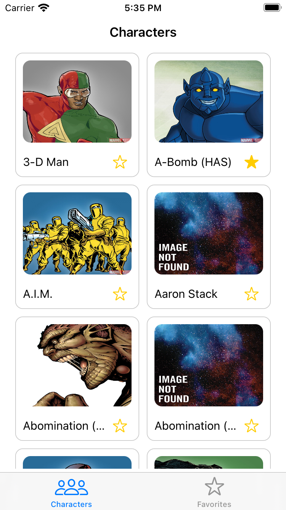
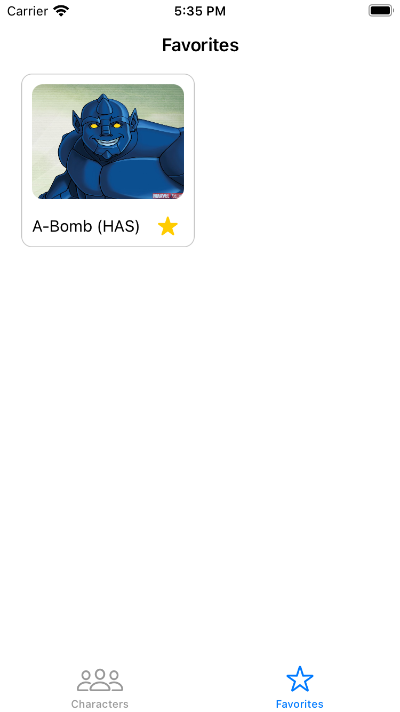
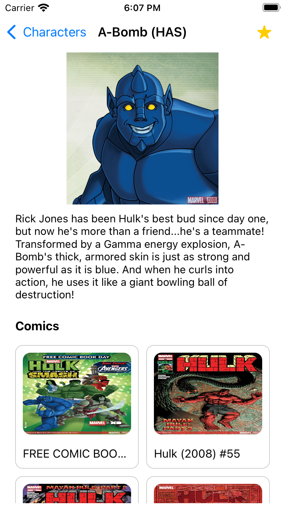

# Desafio - Desenvolvedor iOS XP Inc.

### API

- [Marvel Doc](https://developer.marvel.com/docs.)

### Home - Characters

- Listagem dos personagens ordenados por ordem :abc: alfabética.
- Botão para favoritar :star: personagem nas células.
- Paginação na lista:
    - Carregar **20 personagens** :space_invader: por vez, baixando a próxima página ao chegar no fim da lista.
- Interface de :warning: erro ou sem internet.

### Detalhes do personagem

- Botão de favorito :star:.
- Foto :foggy: em tamanho maior.
- Nome do personagem na barra de navegação.
- Descrição do personagem :space_invader: se houver, caso contrário exibir uma mensagem  *"sem descrição."* .
- Lista de Comics *(se houver)*.
- Lista de Series *(se houver)*.

### Favoritos

- Listagem dos personagens favoritados pelo usuário *(exibindo apenas o nome e imagem do personagem)*.
- Não há limite de personagens a serem favoritados :metal:.
- Favoritos devem ser persistidos (apenas nome e imagem do personagem) localmente para serem acessados offline.

## Utilizado

- Swift 5.
- Pods
  - SwiftHash
  - SDWebImage

### Resultado

|   |  |  |
|:---:|:---:|:---:|
| Lista de Personagens | Favoritos | Detalhes do Personagem |

|  |
|:---:|
| Demonstration |
